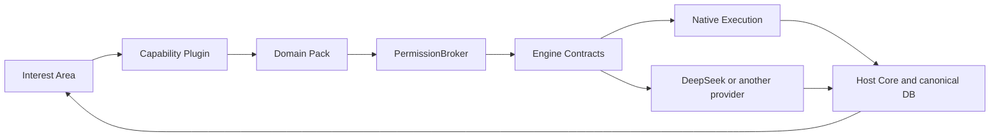

# Interest Growth

[](../../actions/workflows/ci.yml)


An AI-assisted system for cultivating durable interests through curiosity,
learning, evidence, practice, expression, and growth feedback.

一个通过好奇、学习、证据、练习、表达与成长反馈来培养持久兴趣的 AI
辅助系统。

## Why Interest Growth

Interest Growth is not a content-production machine, a test-drilling machine,
or a substitute for human thought. Its intended loop is:

```text
real question -> learning -> retrieval/research -> Evidence
-> Concept/Mastery -> Practice -> personal understanding -> expression
-> Human Review -> feedback -> new question
```

The Host Core and its canonical database remain the source of product truth.
AI output assists the loop; it does not silently promote its own output into
accepted evidence, mastery, writing, or memory.

## Product laws

- `RetrievalCandidate != Evidence`
- `AI answer != Mastery`
- `Practice correct != automatic Mastery`
- `Agent Memory != Growth Memory`
- writing and Living Book output remain proposals until Host acceptance

## Architecture



An Interest Area is what the user cultivates. A Capability Plugin defines what
the product can do, a Domain Pack defines domain behavior, the PermissionBroker
authorizes an operation, and an execution engine performs only that authorized
operation. Native execution owns only checkpoint, event, and auxiliary memory
state; it does not create a second canonical product database.

## Current status

This directory is the standalone **v0.6.0 RC2 Native Execution Core** package.
It restores the reviewed v0.3 runtime invariants and remains independently
verifiable. The repository root now contains the physically merged v0.5 Host;
the standalone package is not a second Host and does not own canonical product
truth. Current merged verification evidence is recorded in the root
`PROJECT_STATUS.md` and `docs/FINAL_RC2_AUDIT.md`.

## Capabilities

- Tutor, including same-turn wait/resume and sequence-cursor reconnect
- Research and sanitized source candidates
- Knowledge/RAG with provenance-preserving retrieval
- Skills and Persona snapshots with fingerprints
- Mastery proposals, Notebook, and Practice without automatic promotion
- Co-Writer and Living Book proposals with stale-base protection
- auxiliary Agent Memory, distinct from canonical Growth Memory
- Visualize, Deep Solve, and reviewable Math Animator plans

## RAG honesty

The lightweight native engines have distinct IDs: `native-lexical`,
`native-lightgraph`, `native-concept-graph`, and `native-heading`.

Legacy IDs such as `llamaindex`, `lightrag`, `graphrag`, and `pageindex` require
a reviewed exact adapter connected to the actual third-party implementation.
Without one, the operation requires review. The runtime never silently aliases a
legacy engine name to a different native algorithm. Exact adapters receive
whole-KB original Host Source snapshots and must map collision-safe external
filenames back to canonical Source provenance.

## Quick start

macOS and Linux:

```bash
python3.12 -m venv .venv
source .venv/bin/activate
python -m pip install -U pip
python -m pip install -e ".[dev,api]"
python scripts/audit_public_repo.py
python scripts/verify.py
```

Windows PowerShell:

```powershell
py -3.12 -m venv .venv
.venv\Scripts\Activate.ps1
python -m pip install -U pip
python -m pip install -e ".[dev,api]"
python scripts/audit_public_repo.py
python scripts/verify.py
```

Python 3.11 and 3.12 are verified in CI.

## Documentation

- [v0.3 cross-validation](docs/V03_CROSS_VALIDATION_RC2.md)
- [final RC2 audit](docs/FINAL_RC2_AUDIT.md)
- [Host merge checklist](docs/HOST_MERGE_CHECKLIST_RC2.md)
- [release notes](RELEASE_NOTES_v0.6.0-rc2.md)
- [third-party notices](THIRD_PARTY_NOTICES.md)
- [security policy](SECURITY.md)
- [contributing](CONTRIBUTING.md)

## Security and human review

Research citations are `candidate_not_evidence` until Host Source, Evidence,
Claim, and Human Review workflows promote them. The same proposal boundary
applies to mastery, writing, books, and visual artifacts. See
[SECURITY.md](SECURITY.md) for reporting and supported-scope details.

## License

No open-source license has been selected yet. Public source visibility does not
by itself grant reuse rights.
